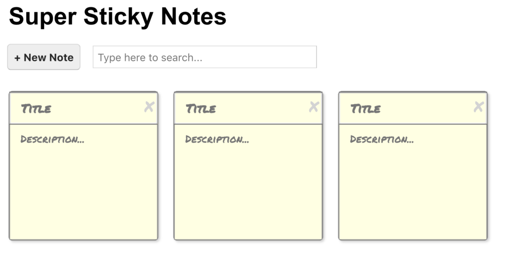

<a name="readme-top"></a>




<!-- TABLE OF CONTENTS -->

# 📗 Table of Contents

- [📖 About the Project](#about-project)
  - [🛠 Built With](#built-with)
    - [Key Features](#key-features)
  - [🚀 Live Demo](#live-demo)
- [💻 Getting Started](#getting-started)
  - [Prerequisites](#prerequisites)
  - [Setup](#setup)
  - [Install](#install)
  - [Usage](#usage)
  - [Run tests](#run-tests)
- [👥 Authors](#authors)
- [🔭 Future Features](#future-features)
- [🤝 Contributing](#contributing)
- [⭐️ Show your support](#support)
- [🙏 Acknowledgements](#acknowledgements)
- [:question: FAQ](#faq)
- [📝 License](#license)

<!-- PROJECT DESCRIPTION -->

# 📖 Sticky Notes <a name="about-project"></a>

**Sticky Notes:** This is a simple web-based Note list application built using React.js. The application allows users to create, read, update, and delete notes from their Sticky Notes. Users can search for specific notes. It uses local storage to store the user's notes, so they don't have to worry about losing their data. This project is a great starting point for those who want to learn web development or want to build their own note management application.

## 🛠 Built With <a name="built-with"></a>

  <ul>
    <li>CSS</li>
    <li>React</li>
  </ul>

<!-- Features -->

### Key Features <a name="key-features"></a>

- [x] **Single Page App**
- [x] **Add, Remove, Edit and Delete Functionality**
- [x] **Medium Fidelity Design**

<p align="right">(<a href="#readme-top">back to top</a>)</p>

<!-- LIVE DEMO -->

## 🚀 Live Demo <a name="live-demo"></a>

- [Live Project Demo]()

<p align="right">(<a href="#readme-top">back to top</a>)</p>

<!-- GETTING STARTED -->

## 💻 Getting Started <a name="getting-started"></a>

To get a local copy up and running, follow these steps.

### Prerequisites

In order to run this project you need:

```
   ssh code:
   git@github.com:Nasirkhan294/sticky-notes.git
```

### Setup

Clone this repository to your desired folder:

```
  cd desired-folder
  git clone git@github.com:Nasirkhan294/sticky-notes.git
```
### Install

- Run ` npm install `

### Usage

To run the project, execute the following command:

- Run ` npm start `

### Run tests

To run tests, run the following command:


- To Test CSS linter errors 
```
npx stylelint "**/*.{css,scss}
```

- To Test jsx linter errors  
```
npx eslint "**/*.{js,jsx}
```

- To Run Test files 
```
npm test
```
<p align="right">(<a href="#readme-top">back to top</a>)</p>

<!-- AUTHORS -->

## 👥 Authors <a name="authors"></a>

👤 **Nasirkhan294**

- GitHub: [Github](https://github.com/Nasirkhan294)
- Twitter: [Twitter](https://twitter.com/NasirMa35888225)
- LinkedIn: [LinkedIn](https://www.linkedin.com/in/nasirmahd-8a8/)

<p align="right">(<a href="#readme-top">back to top</a>)</p>

<!-- FUTURE FEATURES -->

## 🔭 Future Features <a name="future-features"></a>

- [ ] **Reorder notes by dragging**

<p align="right">(<a href="#readme-top">back to top</a>)</p>

<!-- CONTRIBUTING -->

## 🤝 Contributing <a name="contributing"></a>

Contributions, issues, and feature requests are welcome!

Feel free to check the [issues page](../../issues/).

<p align="right">(<a href="#readme-top">back to top</a>)</p>

<!-- SUPPORT -->

## ⭐️ Show your support <a name="support"></a>

Please support this project and be a part of something meaningful and impactful. Your contribution can make a significant difference and help us achieve our goals faster.

<p align="right">(<a href="#readme-top">back to top</a>)</p>

<!-- ACKNOWLEDGEMENTS -->

## 🙏 Acknowledgments <a name="acknowledgements"></a>

To all the individuals whose creativity and dedication inspired the codebase, I want to express my heartfelt gratitude. Your tireless efforts have left an indelible mark on this project and your contributions will be remembered for years to come. Thank you for being an integral part of our success.

<p align="right">(<a href="#readme-top">back to top</a>)</p>

## :question: FAQ <a name="faq"></a>

- **Can I fork and reuse this repository?**

Absolutely! Please feel free to fork and reuse this repository for your own projects.

- **Is it okay to improve this repository? Will my changes be accepted?**

Definitely! We welcome any improvements or new ideas you may have. If your changes are good and align with the project's goals, we would be happy to accept them.

<p align="right">(<a href="#readme-top">back to top</a>)</p>

<!-- LICENSE -->

## 📝 License <a name="license"></a>

This project is [MIT](./LICENSE) licensed.

<p align="right">(<a href="#readme-top">back to top</a>)</p>
